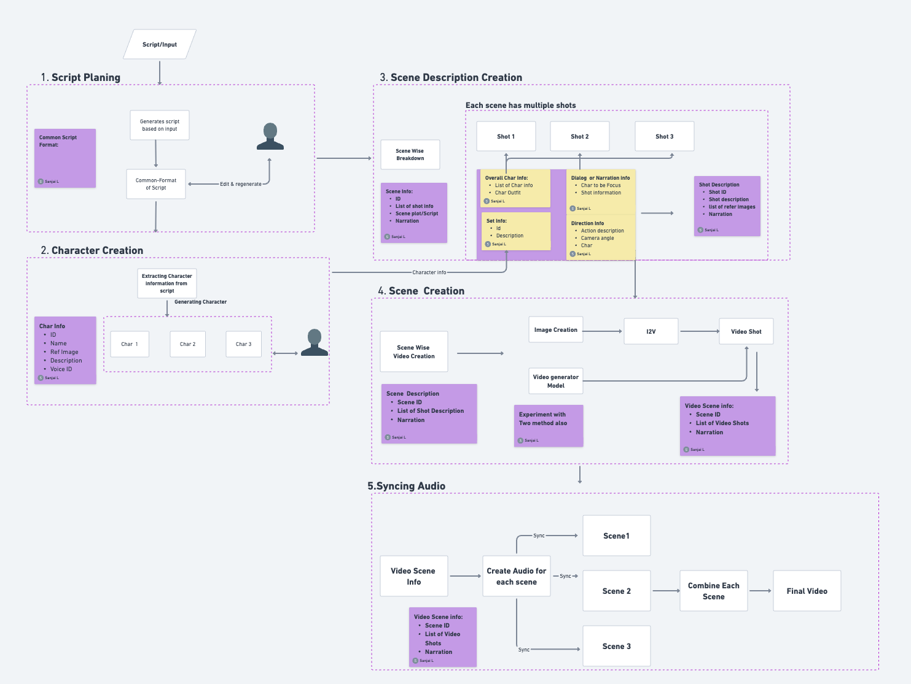

# 🎬 MiniStory-AI Director Platform

**An AI-powered short film generation platform with character consistency and location consistency using cutting-edge AI models**

<div align="center">


**[🎬 Watch Demo](https://youtu.be/o5_jpWK-Zk0) | [📖 Documentation](#-quick-start) | [🚀 Get Started](#installation)**

</div>

## 🌟 Overview

MiniStory-AI is an innovative AI director platform that transforms story ideas into complete short films with consistent characters, locations, and professional video production. The platform leverages state-of-the-art AI models including **Nano Banana** for image generation, **Veo3** for video creation, and **ElevenLabs** for voice design to create cinematic experiences.

### ✨ Key Features

- **🎭 Character Consistency**: AI-generated characters with consistent appearance across all scenes
- **🏢 Location Consistency**: Coherent location designs maintained throughout the film
- **🎬 Intelligent Script Planning**: Automated scene breakdown and shot planning
- **🎥 Cinematic Video Generation**: Professional-quality video creation with proper cinematography
- **🎙️ Voice Design**: Custom voice generation and intelligent character-voice matching
- **📱 User-Friendly Interface**: Streamlit-based web interface for easy project management
- **💾 Session Management**: Project persistence with comprehensive data tracking

## 🏗️ System Architecture

<div align="center">
  
</div>

### 🔄 Pipeline Overview

```mermaid
flowchart TD
    A[📝 Script Input] --> B[🎬 Script Planning Engine]
    B --> C[🎭 Character Generation Pipeline]
    B --> D[🏢 Location Generation System]
    C --> E[📋 Scene Description Creation]
    D --> E
    E --> F[🎥 Scene Creation Engine]
    F --> G[🎙️ Voice Design & Audio Sync]
    G --> H[🎬 Video Assembly Manager]
    H --> I[🎉 Final Video Output]
    
    B -.-> J[LLM]
    C -.-> K[Nano Banana]
    D -.-> L[Nano Banana]
    E -.-> M[Gemini]
    F -.-> N[FAL(Veo3) ]
    G -.-> O[ElevenLabs Voice design+TTS]
    H -.-> P[FFmpeg + Custom Logic - PENDING]
    
    style A fill:#e1f5fe
    style I fill:#e8f5e8
    style P fill:#fff3e0
```

### 🔧 Core Components

| Component | Technology Stack | Status | Description |
|-----------|------------------|--------|-------------|
| **🎬 Script Formatter** | LLM + Custom Logic | ✅ Complete | Converts raw scripts into structured scene and shot data |
| **🎭 Character Generator** | NanoBanana  | ✅ Complete | Creates consistent character images and profiles |
| **🏢 Location Generator** | NanoBanana  | ✅ Complete | Designs and renders film locations |
| **📋 Scene Describer** | LLM | ✅ Complete | Generates detailed scene descriptions with references |
| **🎥 Scene Creator** | Veo3 + Custom Logic | Generates individual scene videos with cinematography |
| **🎙️ Audio Generator** | ElevenLabs + LLM | ✅ Complete | Handles voice synthesis and audio mixing |
| **🎬 Video Assembler** | FFmpeg + Custom Logic | ⏳ Pending | Combines all elements into final film |


## 🏆 Demo & Examples

### 🎥 Live Demo

**Watch the complete MiniStory-AI workflow in action:**

<div align="center">
  
[](https://youtu.be/o5_jpWK-Zk0)

**[🎬 Watch Full Demo on YouTube](https://youtu.be/o5_jpWK-Zk0)**

</div>

## 🚀 Quick Start

### Prerequisites

- Python 3.8+
- API Keys for:
  - OpenAI (GPT-4)
  - Google Gemini
  - ElevenLabs
  - FAL

### Installation

1. **Clone the repository**
   ```bash
   git clone <repository-url>
   cd story_generator
   ```

2. **Install dependencies**
   ```bash
   pip install -r requirement.txt
   ```

3. **Set up environment variables**
   ```bash
   cp .env.example .env
   # Edit .env file with your API keys
   ```

4. **Required API Keys in .env file:**
   ```env
   OPENAI_API_KEY=your_openai_api_key
   GEMINI_API_KEY=your_gemini_api_key
   ELEVENLABS_API_KEY=your_elevenlabs_api_key
   FAL_KEY=your_fal_api_key
   ```

### Running the Application

```bash
# Method 1: Using the launcher script
python run_app.py

# Method 2: Direct Streamlit execution
streamlit run app.py --server.port 8501
```

The application will open in your browser at `http://localhost:8501`

## 📋 Production Workflow

### Step 1: Script Planning 📝
- Input your story idea or raw script
- AI analyzes and structures scenes
- Generates shot breakdowns with camera angles
- Extracts characters and locations

### Step 2: Character Generation 🎭
- AI creates character profiles and descriptions
- Generates consistent character images using Nano Banana
- Maintains visual consistency across all scenes
- Assigns appropriate voice profiles

### Step 3: Location Generation 🏢
- Extracts locations from script
- Generates location images with proper lighting and atmosphere
- Ensures visual consistency throughout the film
- Creates reference images for scene generation

### Step 4: Scene Creation 🎥
- Generates individual scene videos using Veo3
- Maintains character and location consistency
- Applies proper cinematography and lighting
- Creates scene-specific narration and dialogue

### Step 5: Voice Design & Audio 🎙️
- Generates custom voices using ElevenLabs
- Intelligent character-voice matching
- Creates narration and dialogue audio
- Handles background music and sound effects

### Step 6: Video Assembly 🎬
- **[PENDING IMPLEMENTATION]** - Final video assembly system
- Combines all scene videos into complete film
- Adds transitions and effects
- Integrating Voice for each character and automated editing
- Exports final production-ready video

## 📁 Project Structure

```
story_generator/
├── app.py                          # Main Streamlit application
├── run_app.py                      # Application launcher
├── project_manager.py              # Project session management
├── pipeline_steps.py               # Core pipeline logic
│
├── script_planning/                # Script analysis and formatting
│   ├── script_formater.py         # Scene structure generation
│   └── shot_formater.py           # Shot breakdown and planning
│
├── character_generation/           # Character creation pipeline
│   └── character_generator.py     # Character image generation
│
├── location_generation/            # Location design system
│   └── location_generator.py      # Location image generation
│
├── scene_creation/                 # Scene video generation
│   ├── scene_creator.py           # Scene orchestration
│   ├── scene_image_generator.py   # Scene image creation
│   └── scene_video_generator.py   # Video generation with Veo3
│
├── video_editing/                  # Audio and video processing
│   ├── audio_generator.py         # Voice and audio synthesis
│   ├── dialog_mapper.py           # Dialogue mapping
│   ├── intelligent_voice_matcher.py # AI voice assignment
│   ├── video_assembler.py         # Video compilation
│   └── voice_design/
│       └── generate_voice_id.py   # Custom voice creation
│
├── models/                         # Data models and schemas
│   └── pydantic_model.py          # Type definitions
│
├── utils/                          # Utility functions
│   └── llm.py                     # LLM provider management
│
└── data/                          # Generated project data
    └── [project_sessions]/        # Individual project outputs
```

## 🤖 AI Models Integration

### Text Generation
- **GPT-4 (OpenAI)**: Script analysis, character development, scene planning
- **Gemini (Google)**: Scene description generation, visual prompting

### Image Generation
- **Nano Banana (FAL)**: Character and location image generation
- **Gemini Vision**: Image analysis and reference processing

### Video Generation
- **Veo3**: High-quality scene video generation with cinematography

### Voice Synthesis
- **ElevenLabs**: Custom voice generation and character voice matching

## 🎯 Current Status

### ✅ Completed Features
- ✅ Script planning and scene breakdown
- ✅ Character generation with consistency
- ✅ Location generation and design
- ✅ Scene image creation
- ✅ Voice design and synthesis
- ✅ Project session management
- ✅ Streamlit web interface

### 🚧 In Development
- 🚧 Scene video generation optimization
- 🚧 Audio-video synchronization
- 🚧 Advanced cinematography controls

### 📋 Pending Implementation
- ⏳ **Final video assembly system** - The complete video compilation pipeline
- ⏳ Advanced editing features (transitions, effects)
- ⏳ Batch processing capabilities
- ⏳ Export format options (MP4, MOV, etc.)

## 🔧 Configuration

### Environment Variables
```env
# OpenAI Configuration
OPENAI_API_KEY=your_openai_key

# Google Gemini Configuration  
GEMINI_API_KEY=your_gemini_key

# ElevenLabs Configuration
ELEVENLABS_API_KEY=your_elevenlabs_key

# FAL for veo3
FAL_KEY=your_fal_key

DEFAULT_MODEL=gpt-4o-mini
SCENE_MODEL=gemini-2.5-flash
```

### Model Configuration
The platform supports multiple AI providers through the unified LLM interface:
- OpenAI models (GPT-4, GPT-4o-mini)
- Anthropic models (Claude)
- Google models (Gemini)
- Replicate models

## 🎬 Sample Output

The platform generates complete project structures with:
- **Script Planning**: Structured scenes and shots
- **Character Assets**: Consistent character images and profiles
- **Location Assets**: Professional location renders
- **Audio Assets**: Custom voices and dialogue
- **Video Scenes**: Individual scene videos
- **Project Metadata**: Complete production information

## 🔮 Future Scope

### TO DO:
-Complete Automated Video Editing and Voice integration for each shot

### Planned Features
- **Advanced Video Assembly**: Complete automated film compilation


### Technical Improvements
- **Performance Optimization**: Faster generation times
- **Quality Enhancement**: Higher resolution outputs
- **Memory Management**: Optimized resource usage
- **Caching System**: Intelligent asset caching
- **Error Recovery**: Robust error handling and recovery


> **Note**: For the best experience, click the video above to watch on YouTube with full resolution and sound.

The demo showcases:
- ✅ Complete script-to-video workflow
- ✅ Character consistency across scenes  
- ✅ Location generation and design
- ✅ Voice synthesis and character matching
- ✅ Scene creation with proper cinematography
- 🚧 Final video assembly (in development)

### 📊 Sample Outputs


## 📄 License

This project is licensed under the MIT License - see the LICENSE file for details.

## 🤝 Contributing

Contributions are welcome! Please feel free to submit a Pull Request.

## 📞 Support

For support and questions:
- Create an issue in the repository
- Contact the development team

---

**MiniStory-AI** - Transforming imagination into cinematic reality through the power of artificial intelligence.
